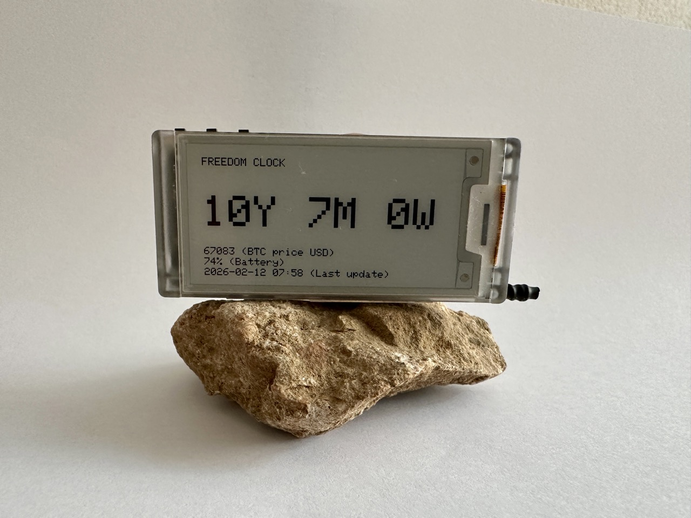

# 🟠 Bitcoin Freedom Clock - Heltec Vision Master E213

> **Finally, a meaningful stat for humans.**

A low-power **Freedom Clock** built on the **Heltec Vision Master E213** (ESP32-S3 + 2.13" e-ink display).

It connects to your local network via Wi-Fi, pulls **BTC price** + your **total BTC balance** over MQTT, and shows one simple output:

**How long could you live for “free” if you sold all BTC today and lived off USD — accounting for inflation?**

---

## 📸 Photo



---

## ✨ What it shows

On the e-ink display:

- **Years + Months + Weeks** of “freedom time”
- BTC price (USD)
- Battery %
- Last update timestamp

No BTC balance or USD net worth is shown on the screen (by design).

---

## 🧠 Concept (how it’s calculated)

This clock models a simple scenario:

1) You sell your BTC today for USD (at current BTC/USD price)  
2) You spend a fixed **monthly budget** (e.g. $10,000)  
3) Your expenses increase every year by **inflation** (default 2%)  
4) It calculates **how long the USD stash lasts** → displayed as **Years / Months / Weeks**

This is not meant to be “financial advice”. It’s a *time metric*.

---

## 🧰 Hardware

- **Heltec Vision Master E213**  
  ESP32-S3 + 2.13" e-ink display (250×122)  
  👉 Buy here: https://heltec.org/project/vision-master-e213/

- **3.7 V LiPo battery (JST connector)**  
  Optional, but recommended for clean wireless placement

No additional hardware required.

---

## 🏗 How it works

- ESP32 connects to Wi-Fi
- Subscribes to MQTT topics:
  - BTC price (USD)
  - Total BTC balance (sum of wallets)
- Computes freedom time with inflation
- Updates the e-ink screen
- Enters deep sleep to save battery

---

## 📡 MQTT topics

### Required topics

```
home/bitcoin/price/usd
home/bitcoin/wallets/total_btc
```

**Use retained MQTT messages** so the device receives the latest values immediately after waking.

---

## 🔧 Configuration (expenses, inflation, update interval)

Edit these constants in the `.ino`:

```cpp
// Base monthly expense in USD (today)
static constexpr float MONTHLY_EXP_USD = 10000.0f;

// Annual inflation rate (0.02 = 2%)
static constexpr float INFLATION_ANNUAL = 0.02f;

// Deep sleep interval (minutes)
static constexpr uint64_t SLEEP_MINUTES = 60;
```

Examples:
- `MONTHLY_EXP_USD = 8000` → more freedom time
- `INFLATION_ANNUAL = 0.03` → less freedom time
- `SLEEP_MINUTES = 15` → more frequent updates, lower battery life

---

## 🔐 Configuration & Secrets

Wi-Fi and MQTT credentials are **not committed** to the repository.

Create:

```
secrets.h
```

Example:

```cpp
static const char* WIFI_SSID     = "YOUR_WIFI_NAME";
static const char* WIFI_PASS     = "YOUR_WIFI_PASSWORD";

static const char* MQTT_SERVER   = "192.168.1.144";
static const int   MQTT_PORT     = 1883;
static const char* MQTT_USER     = "mqtt";
static const char* MQTT_PASS     = "mqtt";
```

`secrets.h` should be ignored via `.gitignore`.

---

## 🧩 Where the MQTT data comes from

Typical setup:

- **Bitcoin Core / node script** publishes:
  - `home/bitcoin/price/usd`
  - `home/bitcoin/wallets/total_btc` (sum of multiple wallets)

This repo assumes your node already publishes these topics (or Home Assistant does).

---

## ✅ Build & Flash

1) Install Heltec ESP32 framework (per Heltec docs)
2) Open the `.ino` in Arduino IDE
3) Select board: **Heltec Vision Master E213**
4) Add your `secrets.h`
5) Flash the device

---

## 📜 License

MIT

---

🟠 If you build one, fork it, improve it, and make it yours.
